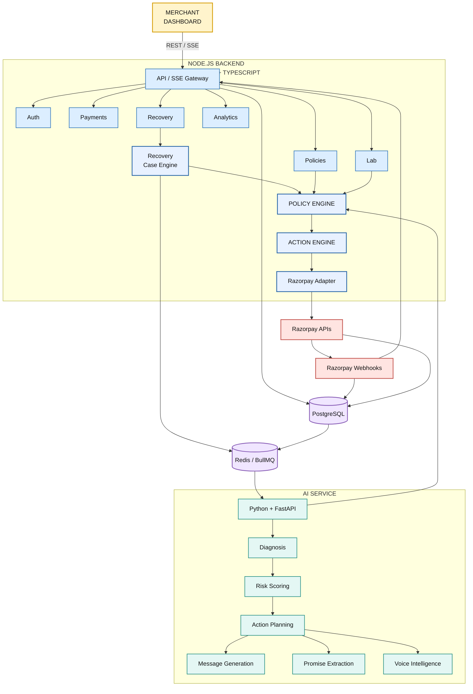

# RevenueOS Architecture

```mermaid
flowchart TD

    %% =====================================================
    %% MERCHANT
    %% =====================================================

    MERCHANT["MERCHANT<br/>DASHBOARD"]

    MERCHANT -->|"REST / SSE"| API_GATEWAY


    %% =====================================================
    %% NODE.JS BACKEND
    %% =====================================================

    subgraph BACKEND["NODE.JS BACKEND<br/>EXPRESS + TYPESCRIPT"]

        direction TB

        API_GATEWAY["API / SSE Gateway"]

        AUTH["Auth"]
        PAYMENTS["Payments"]
        RECOVERY["Recovery"]
        POLICIES["Policies"]
        ANALYTICS["Analytics"]
        LAB["Lab"]

        RECOVERY_ENGINE["Recovery<br/>Case Engine"]

        POLICY["POLICY ENGINE"]

        ACTION["ACTION ENGINE"]

        ADAPTER["Razorpay Adapter"]


        API_GATEWAY --> AUTH
        API_GATEWAY --> PAYMENTS
        API_GATEWAY --> RECOVERY
        API_GATEWAY --> POLICIES
        API_GATEWAY --> ANALYTICS
        API_GATEWAY --> LAB

        RECOVERY --> RECOVERY_ENGINE

        RECOVERY_ENGINE --> POLICY

        POLICIES --> POLICY
        LAB --> POLICY

        POLICY --> ACTION

        ACTION --> ADAPTER

    end


    %% =====================================================
    %% RAZORPAY
    %% =====================================================

    WEBHOOK["Razorpay Webhooks"]

    RAZORPAY_API["Razorpay APIs"]


    ADAPTER --> RAZORPAY_API

    WEBHOOK --> API_GATEWAY

    RAZORPAY_API --> WEBHOOK


    %% =====================================================
    %% DATABASE
    %% =====================================================

    DB[("PostgreSQL")]

    API_GATEWAY --> DB

    WEBHOOK --> DB

    RAZORPAY_API --> DB


    %% =====================================================
    %% REDIS / BULLMQ
    %% =====================================================

    QUEUE[("Redis / BullMQ")]

    RECOVERY_ENGINE --> QUEUE

    DB --> QUEUE


    %% =====================================================
    %% AI SERVICE
    %% =====================================================

    subgraph AI_SERVICE["AI SERVICE"]

        direction TB

        AI["Python + FastAPI"]

        DIAG["Diagnosis"]

        RISK["Risk Scoring"]

        PLAN["Action Planning"]

        MESSAGE["Message Generation"]

        PROMISE["Promise Extraction"]

        VOICE["Voice Intelligence"]

        AI --> DIAG
        DIAG --> RISK
        RISK --> PLAN

        PLAN --> MESSAGE
        PLAN --> PROMISE
        PLAN --> VOICE

    end


    QUEUE --> AI

    AI --> POLICY


    %% =====================================================
    %% STYLING
    %% =====================================================

    classDef merchant fill:#fff4cc,stroke:#d59b00,stroke-width:2px,color:#111;

    classDef backend fill:#dceeff,stroke:#3478b9,stroke-width:1.5px,color:#111;

    classDef engine fill:#e8f1ff,stroke:#2563a6,stroke-width:2px,color:#111;

    classDef external fill:#ffe4e1,stroke:#c65b55,stroke-width:2px,color:#111;

    classDef database fill:#f0e6ff,stroke:#875bb5,stroke-width:2px,color:#111;

    classDef ai fill:#e4f7f4,stroke:#258f83,stroke-width:1.5px,color:#111;


    class MERCHANT merchant;

    class API_GATEWAY,AUTH,PAYMENTS,RECOVERY,POLICIES,ANALYTICS,LAB backend;

    class RECOVERY_ENGINE,POLICY,ACTION,ADAPTER engine;

    class WEBHOOK,RAZORPAY_API external;

    class DB,QUEUE database;

    class AI,DIAG,RISK,PLAN,MESSAGE,PROMISE,VOICE ai;
```